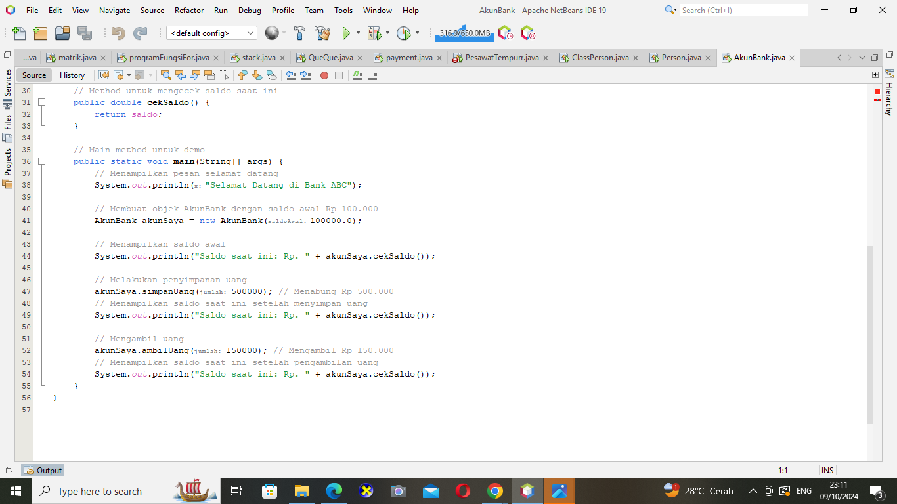

# LATIHAN 1
## 1. Apa yang harus didefinisikan sebelum membuat objek?
- Class adalah cetak biru (blueprint) atau template yang digunakan untuk membuat objek.
- Atribut adalah variabel yang digunakan untuk menyimpan data atau informasi dalam kelas
- Constructor adalah metode khusus yang digunakan untuk menginisialisasi (memberi nilai awal) objek ketika objek tersebut dibuat.
- Metode adalah fungsi atau prosedur yang didefinisikan di dalam kelas dan memungkinkan objek untuk melakukan aksi atau operasi tertentu.

## 2. Buatlah gambar diagram class dan dua buah objek dari class Person bernama Antor dan Riko!
- Diagram Class

  

- Diagram Objek
| Person | Nama | Jenis Kelamin | Umur |
|:------ |:---- |:------------- |:----:|
| Anton  | Anton| L             | 25   |
| Riko   | Riko | L             | 35   |
Objek Antor dan Riko adalah instance dari class Person, yang dimana atribut seperti nama, jenis kelamin, dan umur di isi biodata mereka

## 3. Buatlah gambar diagram objek AkunBank dengan instance method simpanUang, ambilUang dan cekSaldo
- Diagram Class

  

- Diagram Objek
| Akun saya : AkunBank |
|:--------------------:|
|saldo : 100000        |
|simpanUang(500000)    |
|ambilUang(150000)     |
|cekSaldo()            |

# LATIHAN 2
## 1. Mendeklarasikan class Person, dengan atribut Nama, JenisKelamin, Umur

Atribut nama, jenisKelamin, dan umur dideklarasikan sebagai bagian dari class Person. Setiap objek dari class ini akan memiliki ketiga atribut tersebut.
- String nama akan menyimpan nama seseorang.
- String jenisKelamin akan menyimpan jenis kelamin (misalnya: "Laki-laki" atau "Perempuan").
- int umur akan menyimpan umur dalam angka
  
## 2. Buatlah dua buah objek dari class Person bernama Anton dan Riko

Ketika kita membuat objek dari class Person, kita harus memberikan nilai untuk nama, jenisKelamin, dan umur. Nilai-nilai ini kemudian disimpan dalam atribut yang sesuai menggunakan keyword this.
- this.nama = nama; berarti kita menetapkan nilai yang diterima sebagai argumen nama ke atribut nama milik objek yang sedang dibuat.

- Ketika metode ini dipanggil, program akan mencetak nilai dari atribut nama, jenisKelamin, dan umur pada konsol.
- Di dalam metode main, kita membuat dua objek dari class Person, yaitu anton dan riko.
- Person anton = new Person("Anton", "Laki-laki", 25); membuat objek anton dengan nama "Anton", jenisKelamin "Laki-laki", dan umur 25.
- Person riko = new Person("Riko", "Laki-laki", 30); membuat objek riko dengan nama "Riko", jenisKelamin "Laki-laki", dan umur 30.
- Setelah objek dibuat, metode tampilkanInfo() dipanggil untuk setiap objek. Ini akan menampilkan informasi dari masing-masing objek di layar.

# Hasil Output

Output ini menunjukkan bahwa atribut nama, jenisKelamin, dan umur dari masing-masing objek telah dicetak ke layar.

# LATIHAN 3 
## 1. Mendeklarasikan class AkunBank dengan instance method simpanUang, ambilUang dan cekSaldo
## 2. Buat objek AkunBank dan tetapkan nilai saldo awal Rp. 100000, kemudian panggil 3 method tersebut dan tampilkan proses berikut:

## Jawaban Soal 1 dan 2

1. Class AkunBank:
   - Atribut saldo digunakan untuk menyimpan saldo dari akun bank. Constructor 
   - AkunBank(int saldoAwal) digunakan untuk menginisialisasi saldo awal ketika 
2. Method simpanUang(int jumlah):
   - Metode ini menambah saldo dengan nilai jumlah yang diberikan.
   - Setelah saldo ditambahkan, metode ini memanggil cekSaldo() untuk menampilkan saldo terbaru.
3. Method ambilUang(int jumlah):
   - Metode ini mengurangi saldo jika saldo mencukupi, jika tidak, ditampilkan pesan bahwa saldo tidak mencukupi.
   - Setelah mengambil uang, saldo kembali dicek dengan memanggil cekSaldo().
4. Method cokSaldo():
   Mtode ini hanya menampilkan saldo saat ini.
5. Main Class:
   - Membuat objek AkunBank dengan saldo awal sebesar Rp. 100000.
   - Kemudian, memanggil metode simpanUang(500000) untuk menambah saldo dan ambilUang(150000) untuk mengambil uang, serta menampilkan saldo setelah setiap transaksi.

# Hasil Output

- Program menampilkan pesan "Selamat Datang di Bank ABC" dan saldo awal Rp. 100000.
- Setelah menyimpan uang sebesar Rp. 500000, saldo menjadi Rp. 600000.
- Setelah mengambil uang sebesar Rp. 150000, saldo berkurang menjadi Rp. 450000.
